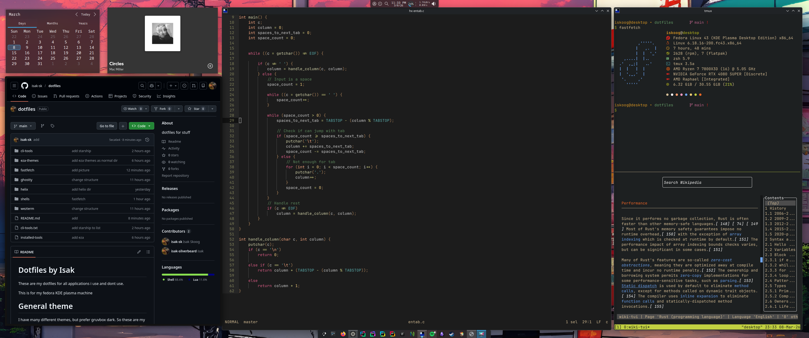

# Dotfiles by Isak




These are my dotfiles for all applications i use and dont use.

This is for my fedora KDE plasma machine


# General theme
I have many different themes, but prefer gruvbox dark. So these are my dotfiles for gruvbox dark.

## Terminal
Ghostty

## Command line prompt
Starship


## Neovim
Neovim

## Helix
Helix

## Zsh
Zsh

## Bash
Bash


## fastfetch
```
sudo dnf install fastfetch
```


